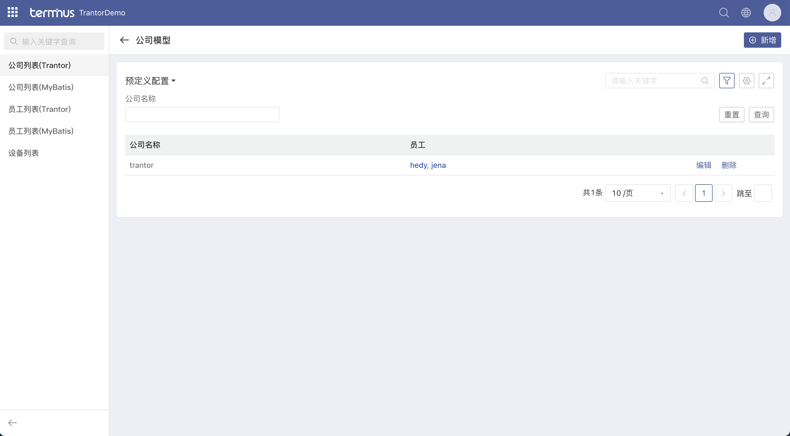

# Trantor0.9版本中集成MyBatis来操作DML
## 注意事项：
1. 因为DDL是由DataStore(以下简称DS)进行管理的。所以相对应的表结构无法变更。例如主键的自增长。
2. DS和MyBatis在部分的DML上无法混用，例如插入数据(因为sequence是由DS独立维护)
3. 在插入数据时候需要手工维护模型的基础信息(id、createdAt、updatedAt、isDeleted、createdBy、updatedBy)
4. 模型与模型一对一的关联关系。因为DS在建表时是自动关联字段。所以MyBatis在做DML时需要先查看一对一的关联字段归属。
## 示例说明：
示例中通过公司、员工、设备的场景来说明一对多、一对一的操作。其中设备因和员工一样所以就直接使用了trantor默认行为。
可以按照图片中的方式建出对应的应用、菜单验证测试。

### 使用Trantor进行DML：

公司新增操作：trantor_demo_mybatis_CompanyModel_CompanyAction::create

公司删除操作：trantor_demo_mybatis_CompanyModel_CompanyAction::delete

公司更新操作：trantor_demo_mybatis_CompanyModel_CompanyAction::update

公司查询操作：trantor_demo_mybatis_CompanyModel_CompanyMultiDataAction

公司新建视图：trantor_demo_mybatis_CompanyModel_createView

公司编辑视图：trantor_demo_mybatis_CompanyModel_editView

公司列表视图：trantor_demo_mybatis_CompanyModel_listView

员工新增操作：trantor_demo_mybatis_StaffModel_StaffAction::create

员工删除操作：trantor_demo_mybatis_StaffModel_StaffAction::delete

员工更新操作：trantor_demo_mybatis_StaffModel_StaffAction::update

员工查询操作：trantor_demo_mybatis_StaffModel_StaffMultiDataAction

员工新建视图：trantor_demo_mybatis_StaffModel_createView

员工编辑视图：trantor_demo_mybatis_StaffModel_editView

员工列表视图：trantor_demo_mybatis_StaffModel_listView

### 使用MyBatis进行DML：

公司新增操作：trantor_demo_mybatis_CompanyModel_CompanyAction::createByMyBatis

公司删除操作：trantor_demo_mybatis_CompanyModel_CompanyAction::deleteByMyBatis

公司更新操作：trantor_demo_mybatis_CompanyModel_CompanyAction::updateByMyBatis

公司查询操作：trantor_demo_mybatis_CompanyModel_CompanyMultiDataActionByMyBatis

公司新建视图：trantor_demo_mybatis_CompanyModel_createMyBatisView

公司编辑视图：trantor_demo_mybatis_CompanyModel_editMyBatisView

公司列表视图：trantor_demo_mybatis_CompanyModel_listMyBatisView

员工新增操作：trantor_demo_mybatis_StaffModel_StaffAction::createByMyBatis

员工删除操作：trantor_demo_mybatis_StaffModel_StaffAction::deleteByMyBatis

员工更新操作：trantor_demo_mybatis_StaffModel_StaffAction::updateByMyBatis

员工查询操作：trantor_demo_mybatis_StaffModel_StaffMultiDataActionByMyBatis

员工新建视图：trantor_demo_mybatis_StaffModel_createMyBatisView

员工编辑视图：trantor_demo_mybatis_StaffModel_editMyBatisView

员工列表视图：trantor_demo_mybatis_StaffModel_listMyBatisView